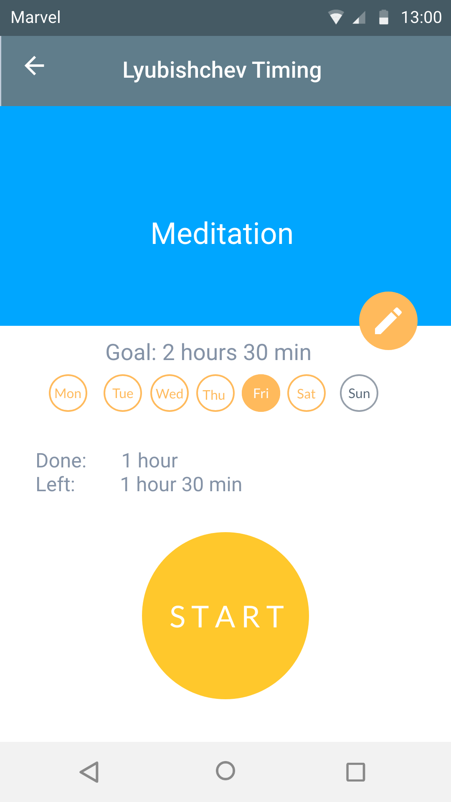
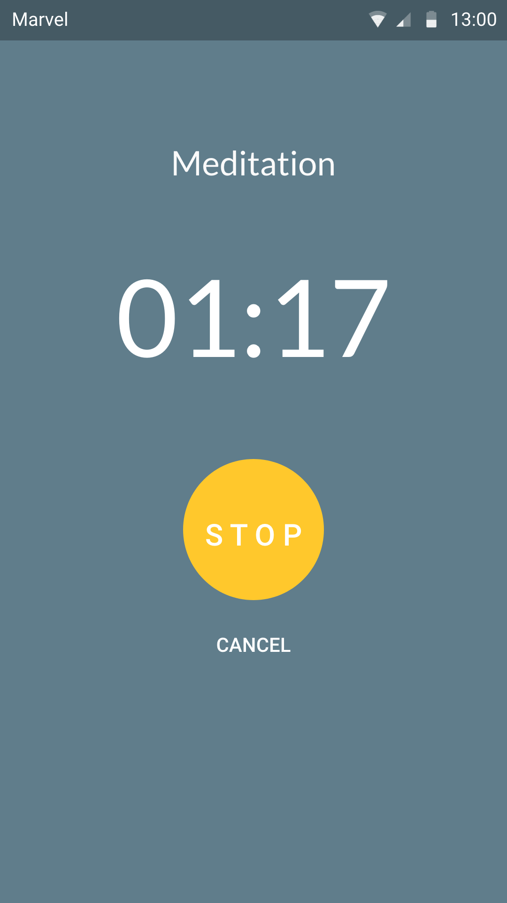
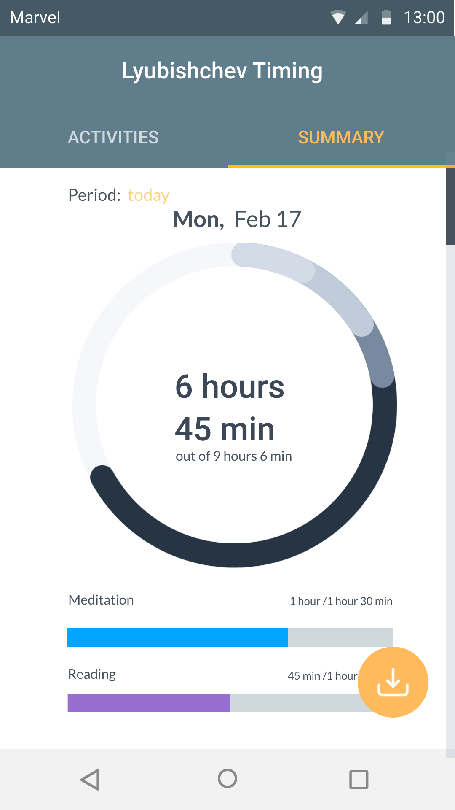
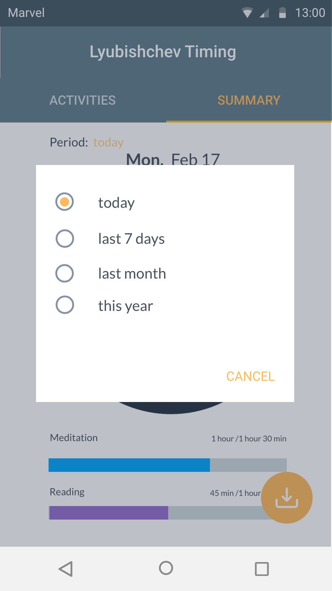
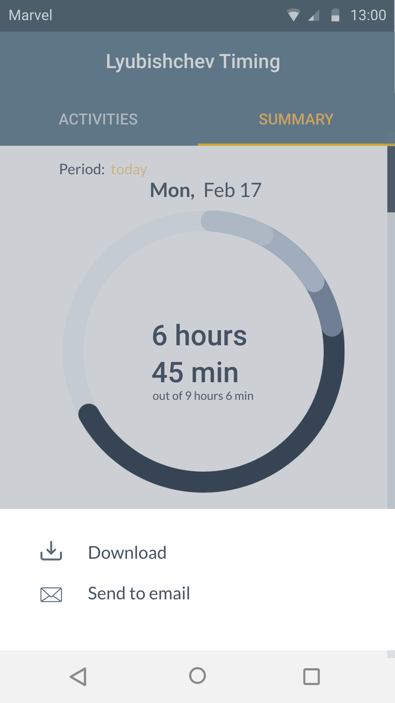
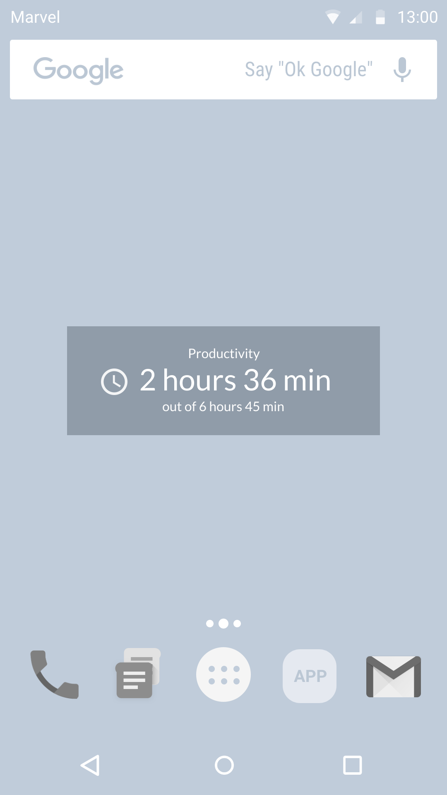

# Lyubishchev Timing App

Lyubishchev Timing is a _simple time-management application_. As a foundation it takes a time-tracking system, developed by Russian-Soviet philosopher and entomologist A.A.Lyubishchev​. The idea is simple: you select an activity that you want and the time-tracker immediately starts. Once you change your activity time-tracker should be also stopped. This app becomes your true mirror: in a small widget it shows how many hours per day were productive, its ruthless reports will tell you if you were good this week, or you simply imitated the activity

### Features 

* Adding activities which user wants to track
* Customizing activities by setting up the bar for specific day
* Start and stop tracking a task by one click
* Analyzing user’s daily/weekly/monthly activity
* Creating pie diagram using analysis of users activity
* Exporting data via email
* Downloading data to the user’s phone

### User Interface Mocks

  
 
  

## Contributions

Contributions are welcome! 
